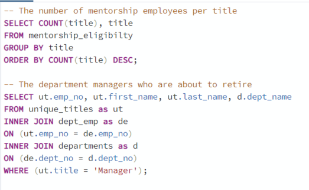

# Pewlett Hackard Analysis
## Overview
In this project, we used PostgreSQL to create Pewlett Hackard’s employment database, and pgAdmin to work with the data. Our original data was stored in six CSVs. We performed queries to find the employees who were ready to retire and created the Tailored lists based on different requirements. 

The following tasks were completed in the challenge.
1. Count the number of retiring employees per title.
2. Identify employees who are eligible to participate in a mentorship program.

## Resources
-	Data Source: departments.csv, dept_emp.csv, dept_manager.csv, employees.csv, salaries.csv, titles.csv (in the Data folder)
-	Software: PostgreSQL 11, Visual Studio Code, 1.52.1

## Results
Retiring_titles.csv and mentorship_eligibilty.csv in the Data folder contained our results.

-	There were 90398 employees who were about to retire in Pewlett Hackard.
-	For employees who were ready to retire, the detailed title information was as follows: There were 29414 Senior Engineers, 28254 Senior Staff, 14222 Engineers, 12243 staff, 4502 Technique Leaders, 1761 Assistant Engineers, and 2 Managers.
-	The most vacant positions in the company would be Senior Engineer, Senior Staff, and Engineer since most people were retiring in these three titles.
-	1549 current employees who were about to retire were eligible for the Mentorship Program.

## Summary
Our results indicated that there were 90398 employees in total who would retire soon. 1549 employees among them were eligible for the mentorship program. 

By adding two following additional queries, we were able to provide more detailed information about the number of mentorship employees per title and the two departments which might need to hire managers.

Table 1 The queries.

Table 2 showed the number of mentorship employees per title. Our result showed that there were 569 Senior Staff, 529 Senior Engineers, 190 Engineers, 155 Staff, 77 Technique Leaders, and 29 Assistant Engineers in the mentorship program. The result indicated that there were enough qualified, retirement-ready employees in the departments to mentor the next generation employees.

Table 2 The number of mentorship employees per title.

Table 3 showed the two department managers who were ready to retire. There might be promotion chances for Sales and Research department employees since their managers were ready to retire.

Table 3 The department managers who were about to retire.

